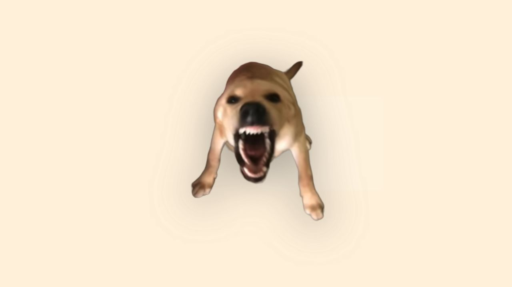

# Dog Bark

English | [中文](./README_CN.md)

An interactive dog-bark webpage with Chinese and English UI, dog-bark sound effects, elastic scaling, and full-screen particle effects.

## Live demo

[大狗叫 / Dog Bark](https://fuck-claude.ai/?a=openai-niubility)



## Run locally

```bash
python3 -m http.server 4173
```

Then open [http://127.0.0.1:4173/](http://127.0.0.1:4173/). The first interaction unlocks browser audio; afterwards, click or drag anywhere to trigger the bark and visual effects.

## Project structure

| Path            | Description                              |
| --------------- | ---------------------------------------- |
| `index.html`    | Page structure, styles, and translations |
| `main.js`       | Audio, animation, and interaction logic  |
| `audio-data.js` | Embedded dog-bark audio data             |
| `Image/`        | Closed- and open-mouth artwork           |

## Acknowledgments

With appreciation to [马克杯MarkCup](https://space.bilibili.com/357762853) and the video [点击即玩世界上最爽的哈基米模拟器](https://www.bilibili.com/video/BV1kNKU6REBg/), which inspired this project.

## License

This project uses the [MIT License](./LICENSE), followed by a non-restrictive additional notice.
